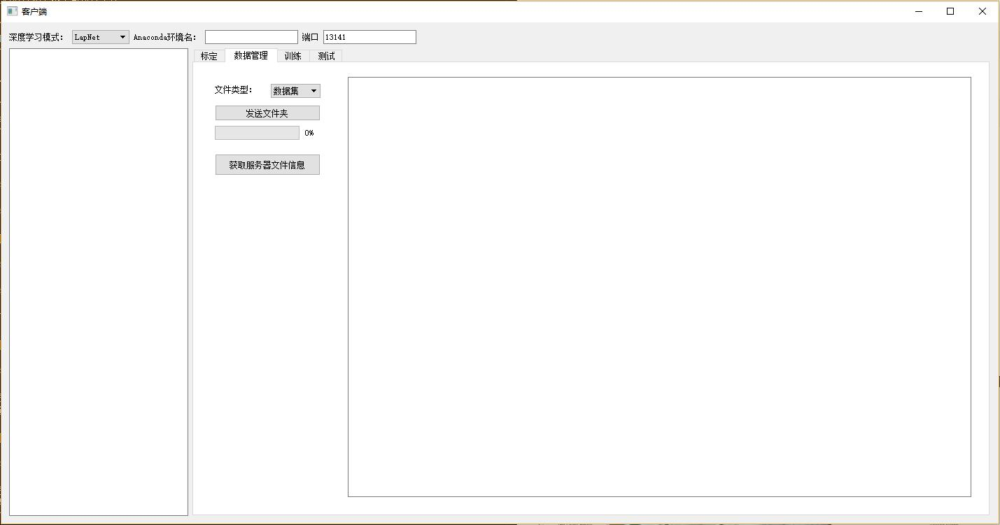
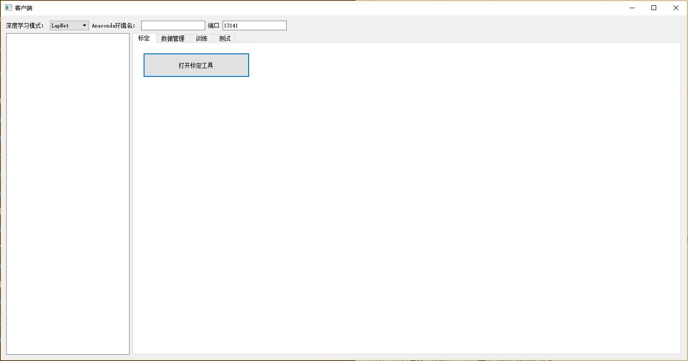
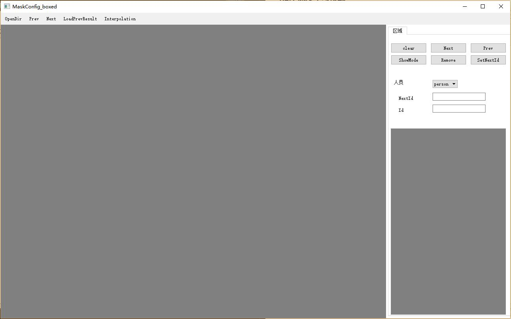
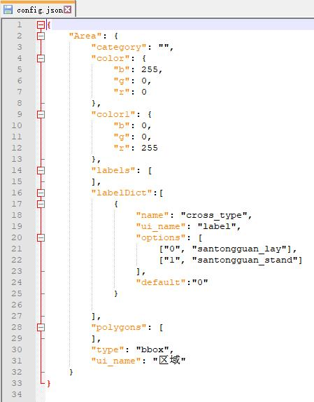
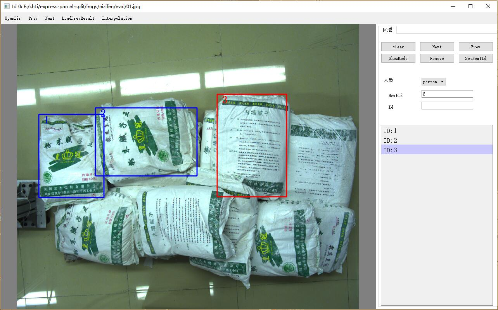
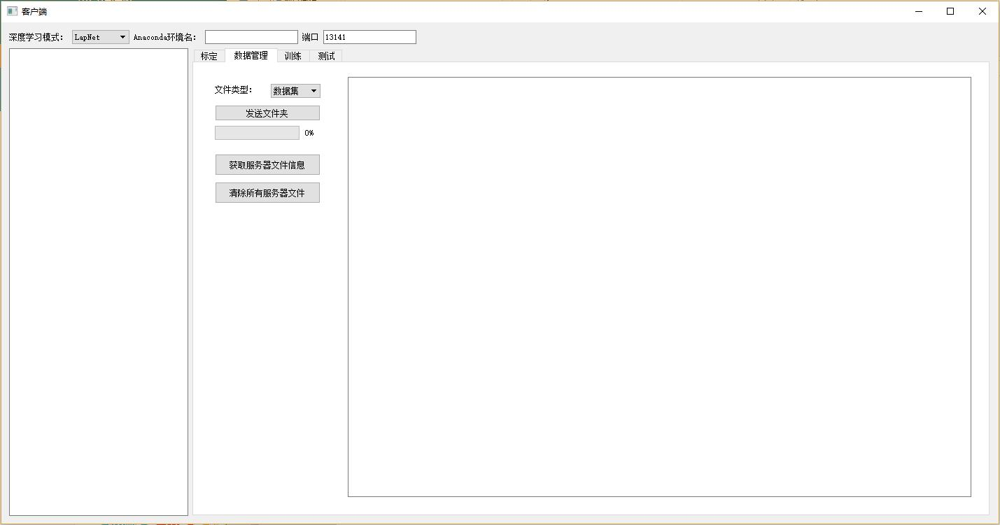
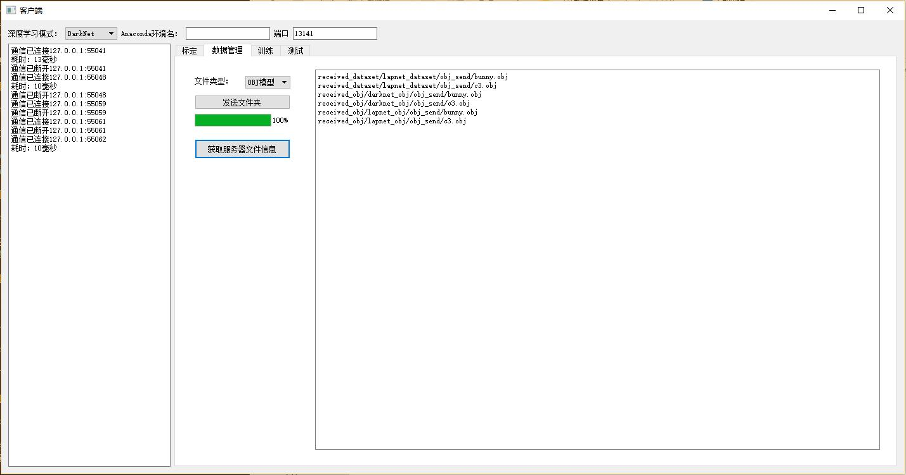
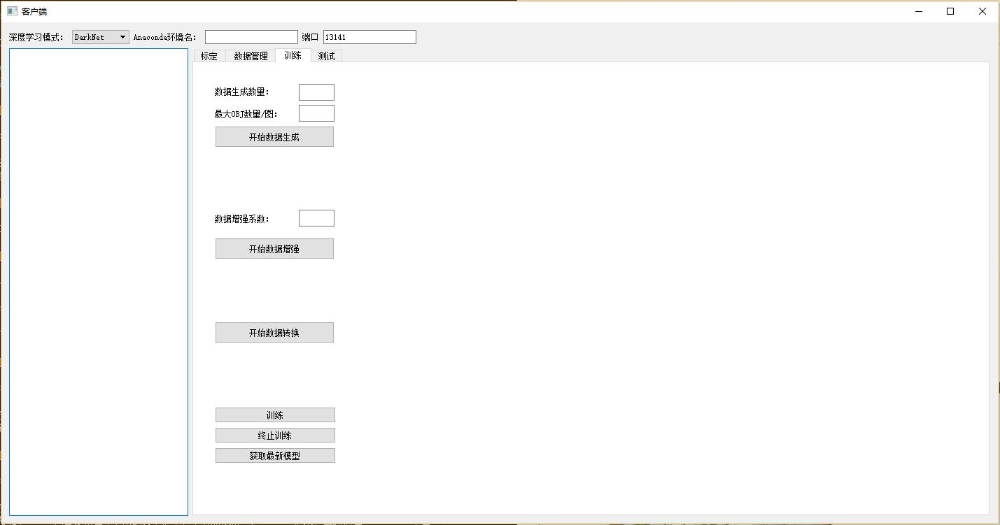

<div  align="center">    

</div>

# <center>FilterSocket 软件使用说明书</center>

<font size=2>
版本：V1.1

发布日期：2020/5/20

<div STYLE="page-break-after: always;"></div>

合肥阿巴赛信息科技有限公司

网址：http://www.abaci3d.cn/
</font>

<div STYLE="page-break-after: always;"></div>

[TOC]

<div STYLE="page-break-after: always;"></div>

## 0 使用之前

### 0.1 Anaconda环境

请确保在您的电脑上安装有Anaconda，并创建了一个安装有torch以及tensorflow的conda虚拟环境
以下我们统称这个环境为“pytorch”，您可以根据自己的实际环境名称进行相应的更改

### 0.2 sudo gedit ~/.bashrc

在ubuntu系统上，需要打开终端，输入

```c++
sudo gedit ~/.bashrc
```

并在最后一行加上

```c++
eval "$RUN_AFTER_BASHRC"
```

然后保存并关闭

### 0.3 Conda Env Name

下方图形化界面中的顶部有一个名为 **Anaconda环境名** 的文本框

请在完成前两步之后，每次运行此程序进行训练前输入您的conda虚拟环境名

```c++
Anaconda环境名: pytorch
```

### 0.4 How to Run

#### 0.4.1 Linux端

打开终端，并将目录切换到

```c++
/FilterSocket_v1.1/Linux/software/
```

之后运行如下命令

```c++
./Client
```

以及

```c++
./Server
```

即可运行此程序

#### 0.4.1 Windows端

进入目录

```c++
/FilterSocket_v1.1/Windows/software/
```

之后运行如下两个可执行文件

```c++
Client_boxed.exe
```

以及

```c++
Server_boxed.exe
```

即可运行此程序

## 1 Client 客户端

### 1.1 图形化界面



### 1.2 功能说明

#### 1.2.1 深度学习模式

用来指定当前所采用的网络模型与训练策略

#### 1.2.2 Anaconda环境名

需要输入在 **0.1** 中创建好的Anaconda环境名称，否则某些训练功能可能不能正常运行

#### 1.2.3 端口

用来与服务端的接收端口进行匹配，当前版本默认为13141，不需要修改，否则可能导致通信失败

#### 1.2.4 左侧数据流

左侧的空白框用来显示当前的连接状态、用时等信息

#### 1.2.5 标定

单击该按钮可以打开标定工具，对现有数据进行标定



标定工具如下图所示



##### 1.2.5.1 数据集对应的 label 的初始化

打开文件

```c++
/FilterSocket_v1.1/Windows/software/config/config.json
```

根据需要仿照第 **21,22** 行修改/增加/删除，直到修改为对应当前待标定数据集的 label



##### 1.2.5.2 选择标定数据集

点击标定工具左上角的 **OpenDir** 按钮，选择待标定数据所在根目录，即可开始进行标定

**注：在完成一张图片的标定之后，程序会在切换到下一张图片时保存当前的标定结果，因此标定完最后一张时需要向前切换一张图片，最后一张才会保存**



#### 1.2.6 数据管理

该部分可以选择发送 **标定好的数据集** 或发送 **相关的 OBJ文件** ，服务端会根据 **当前的深度学习模式** 来确定保存路径，不同模式下发送的文件不会共享 



点击 **获取服务器文件信息** 按钮可以得到当前存储在服务器的所有文件的路径信息



点击 **清除所有服务器文件** 按钮可以清空所有保存在服务器或在服务器生成的文件

#### 1.2.7 训练

在该板块，可以在 **发送过OBJ文件夹之后** 设置需要生成的数据量，进行自动的数据生成，但目前仍处于测试阶段， **生成结果并不能保证达到理想效果**

数据增强与数据转换则可以稳定生成所需的数据集及对应的处理结果，其中

(1) 数据增强会将当前已有的数据进行随机放缩、旋转和平移，生成的新数据集的数量取决于设置的 **数据增强系数** ，如果 **数据增强系数=0** ，则会默认只搬运数据，而不生成新数据

(2) 数据转换会将现有的 **搬运好/数据增强得到的数据集** 转换为 **标准COCO数据集** ，以便能够进行接下来的训练

**注1：数据生成、数据增强、数据转换暂时仅支持处理DarkNet数据集**
**注2：如果仅使用自己标定好的数据集进行训练，则需要发送数据集之后，设置数据增强系数=0，并单击开始数据增强以进行数据搬运**



#### 1.2.8 测试

